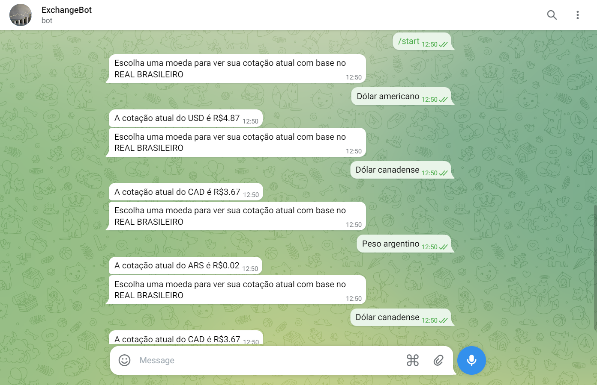
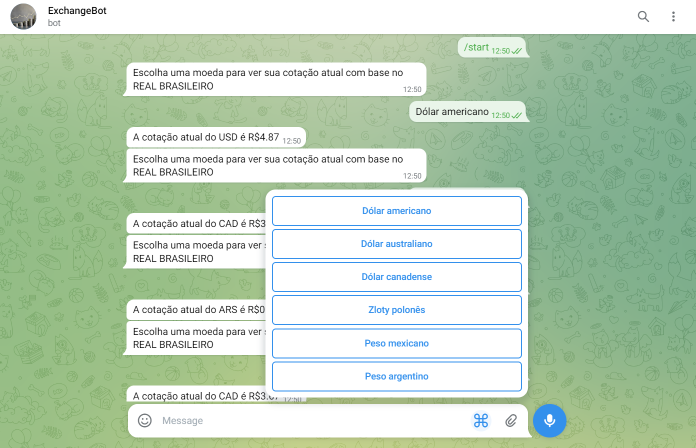

# Bot de Telegram de Cotação de Moedas
Nesse projeto são usadas técnicas de programação orientada a objetos juntamente com a biblioteca pyTelegramBotAPI para
desenvolver um chat bot que informa cotações de algumas moedas em relação ao real brasileiro.

## Descrição
O objetivo do projeto é demonstrar algumas funcionalidades que podem ser exploradas com o desenvolvimento de um bot para
o telegram e criar um método rápido e eficiente para consulta da cotação de moedas a qualquer momento através do
telegram.

## Funcionalidades
* Realizar um request em uma API REST.
* Processar os dados coletados.
* Interagir com o usuário através do telegram.
* Retornar informações da cotação atual de algumas moedas.

## Requisitos
* Python 3.11 ou superior
* Biblioteca pyTelegramBotAPI 4.12.0

## Funcionamento
Instale as bibliotecas em seu ambiente python.
````
pip install -r requirements.txt
````
Execute o main.py.
````
python main.py
````

Pesquise pelo usuário no telegram @gv_exchange_bot ou pelo link t.me/gv_exchange_bot. Digite o comando "/start" e
escolha uma das moedas disponíveis para verificar sua cotação atual com base no real brasileiro.




## Resumo
O bot é definido como um objeto no python e opera com as funções da biblioteca pyTelegramBotAPI implementadas nos
métodos da classe. 

Os dados sobre a cotação atual das moedas são adiquiridos através do request na API api.exchangeratesapi.io, que retorna
os dados em formato JSON e em seguida são tratados no código como um dicionário python.

# Licença
Este projeto está licenciado sob a [MIT License](https://opensource.org/license/mit/).

# Referências
- https://pytba.readthedocs.io/en/latest/
